# BRISCOLA IN 5 ONLINE
Il gioco Briscola in 5 (o briscola a chiamata) è una variante della Briscola. Le regole di base per la vincita delle diverse mani sono le stesse del classico gioco, la variante in cinque, però, si differenzia  principalmente per l’introduzione di una parte iniziale chiamata “**asta**”, durante la quale il giocatore che fa la migliore offerta (“**comandante**”) sceglie quella che sarà la briscola. I giocatori vengono quindi divisi in due squadre: quella “**chiamante**”, composta da comandante ed eventuale “**socio**” (il giocatore che possiede la carta chiamata), e quella “**avversaria**”, di cui fanno parte tutti gli altri giocatori.

## INSTALLAZIONE DEL GIOCO
### REQUISITI
Per poter utilizzare “**Briscola in 5 online**” è prima di tutto necessario installare:
- [Node.js](https://nodejs.org/it/download/) (Installer)
- [Git](https://git-scm.com/download/)

### INSTALLAZIONE DI BRISCOLA IN 5 ONLINE
Aprire un terminale e digitare i seguenti comandi:
```
git clone https://github.com/giorgiatedaldi/briscola_in_5_online
cd briscola_in_5_online/client/
npm install socket.io-client
cd ../server/
npm install express
npm install socket.io
```

### AVVIARE IL GIOCO
```
cd briscola_in_5_online/server/
node server.js
```
Aprire un secondo terminale e seguire i seguenti comandi:
```
cd briscola_in_5_online/client/
npm start
```

## SPECIFICHE E FUNZIONALITÀ
### CONNESSIONE
Il server è in ascolto e rimane in attesa della connessione di client, che devono essere almeno 5. Nel caso in cui ne risultino di più, i client dal sesto in avanti vengono disconnessi, mentre per gli altri può iniziare la partita.

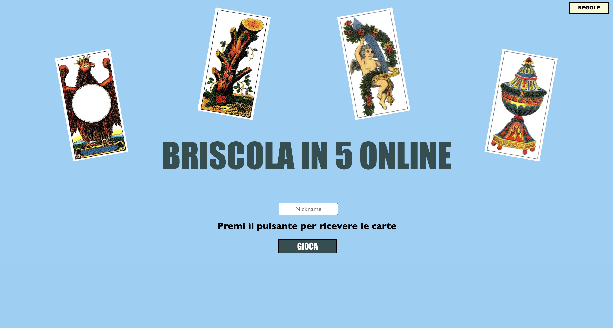

A questo punto ogni client può inserire un nickname altrimenti questo sarà settato all’ID della sua socket. Alla ricezione dei primi 5 giocatori il server genera le carte per ciascun giocatore, ma le distribuisce solo dopo che i client premono il pulsante gioca.
L’ordine di gioco è stabilito in base all’ordine temporale di connessione dei client.

### ASTA
A questo punto il primo giocatore vede la seguente schermata, da cui ha inizio l’asta.

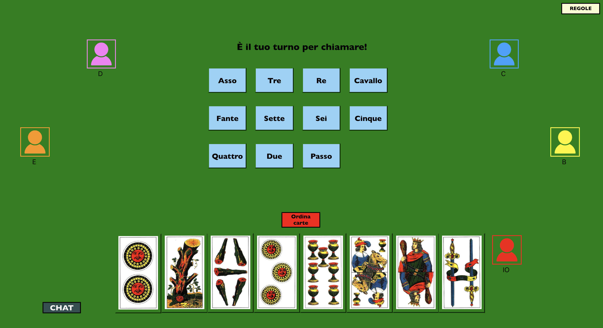

La schermata si aggiorna ogni volta che un giocatore preme uno dei pulsanti per effettuare l’offerta, passando il turno al giocatore successivo: mano mano che un bottone viene premuto,  il server riceve le informazioni dal client in questione, per poi comunicarle a tutti gli altri, in modo che il bottone premuto e tutti quelli precedenti vengano disabilitati per tutti i giocatori.


L’asta prosegue fino a quando tutti i giocatori, tranne uno, hanno passato. A questo punto il comandante deve scegliere qual è il seme premendo sulla carta desiderata, in questo modo la scelta della briscola viene comunicata al server, che a sua volta invierà il messaggio a tutti i client. 


Nel remoto caso in cui tutti i giocatori dovessero passare, le carte vengono ridistribuite e la partita ricomincia normalmente.

### SVOLGIMENTO DEL GIOCO
Dopo la conclusione dell’asta, il comandante è identificato, da tutti i giocatori, con una corona e l’immagine della carta chiamata di fianco all’avatar. La partita inizia con il primo giocatore, le cui carte sono ora selezionabili.

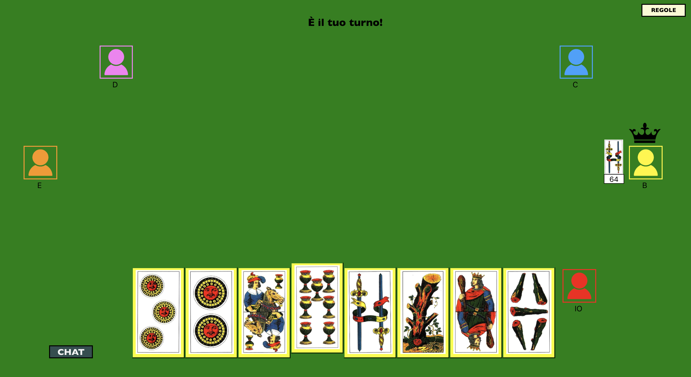

Quando una carta viene giocata, questa viene trasferita sul tavolo ed eliminata dalle carte disponibili del giocatore. 

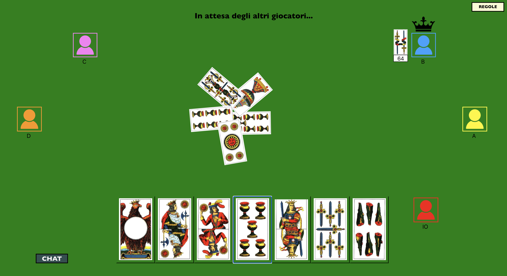

Nel caso in cui una tra le carte giocate sia quella chiamata dal comandante, questa viene visualizzata con un bordino rosso, per mettere in evidenza il comportamento del socio.

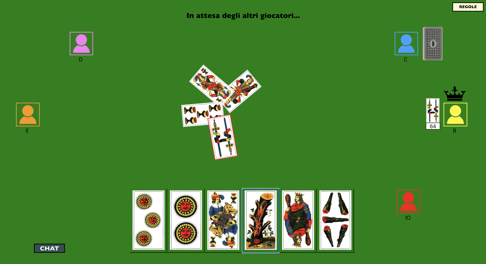

Il giocatore che vince la mano, alla fine di questa, viene affiancato da un mazzetto, ad indicare le carte appena prese.

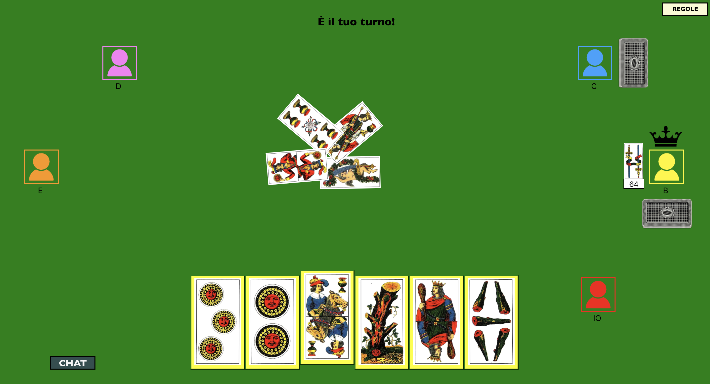

Il gioco prosegue in questo modo fino all’esaurimento delle otto carte di tutti i giocatori.

### ORDINA CARTE
Tramite l’apposito pulsante, che è cliccabile una sola volta e rimane attivo dalla distribuzione iniziale delle carte fino alla penultima mano (durante la quale i giocatori hanno una sola carta in mano), è possibile ordinare le proprie carte per seme e valore. 
Soprattutto nelle prime fasi della partita (asta e prime mani), questa funzionalità può risultare molto comoda per il giocatore, che ha la possibilità di visualizzare le proprie carte in modo più chiaro e leggibile.  
Prima dell’ordinamento:

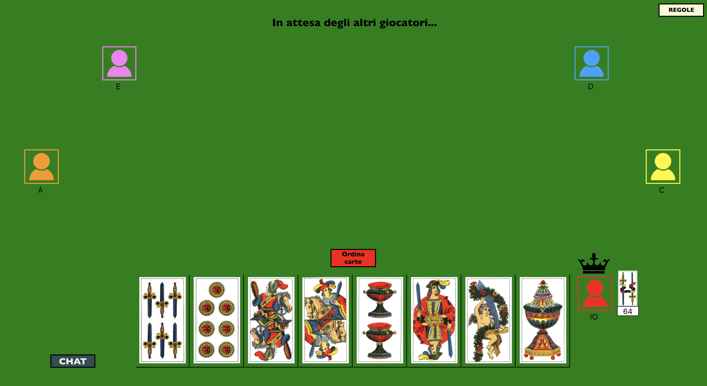

Dopo l’ordinamento:


### ULTIMA MANO
Durante lo svolgimento della partita è sempre possibile vedere l’ultima mano di un qualsiasi giocatore che ne ha vinta almeno una, scorrendo sopra il mazzetto di quest’ultimo. Quando il cursore è posizionato sopra uno dei mazzetti viene mandata una richiesta al server in cui il giocatore interessato a vedere l’ultima mano, comunica il proprio ID e quello del giocatore in questione. A questo punto il server richiede le ultime cinque carte presenti nel mazzo del giocatore di cui vuole essere vista l’ultima mano, e le comunica al richiedente, che ora le può visualizzare.

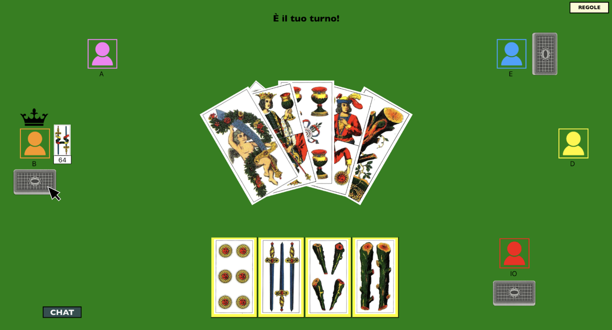

### CHAT
Durante la partita è possibile comunicare con gli altri giocatori tramite una chat comune. Ogni messaggio viene visualizzato dopo l’ID del mittente (dello stesso colore dell’avatar).
La chat si può aprire e chiudere tramite appositi pulsanti in base alle preferenze di ciascun giocatore.

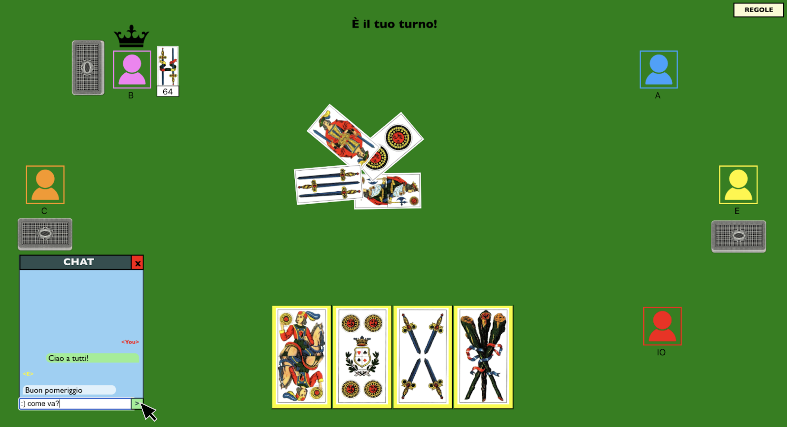

Nel caso in cui ci siano messaggi non letti e la chat sia chiusa, apparirà un simbolo di notifica.

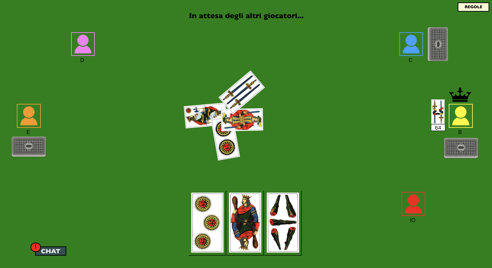

### VISUALIZZAZIONE DEI PUNTEGGI
Alla fine di ogni partita, tutti i giocatori visualizzano una schermata riassuntiva con i punti di ogni squadra e i punteggi individuali della partita, aggiornati rispetto ai precedenti match.

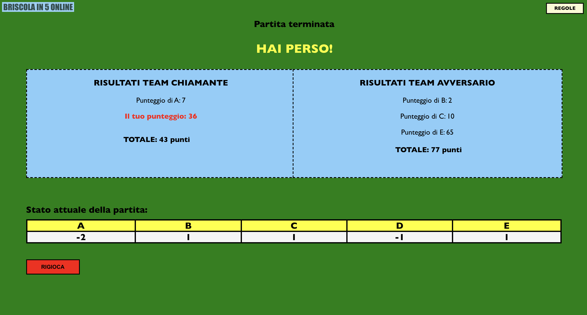

### RIGIOCA
Una volta visualizzata la schermata finale dei punteggi, i giocatori possono scegliere di intraprendere una nuova partita con gli stessi avversari. Nel caso in cui, anche solo uno dei giocatori scegliesse di non giocare nuovamente, le statistiche vengono azzerate e il server rimane in attesa della connessione di un nuovo client, mantenendo aperte le connessioni precedenti e i relativi nickname dei giocatori.

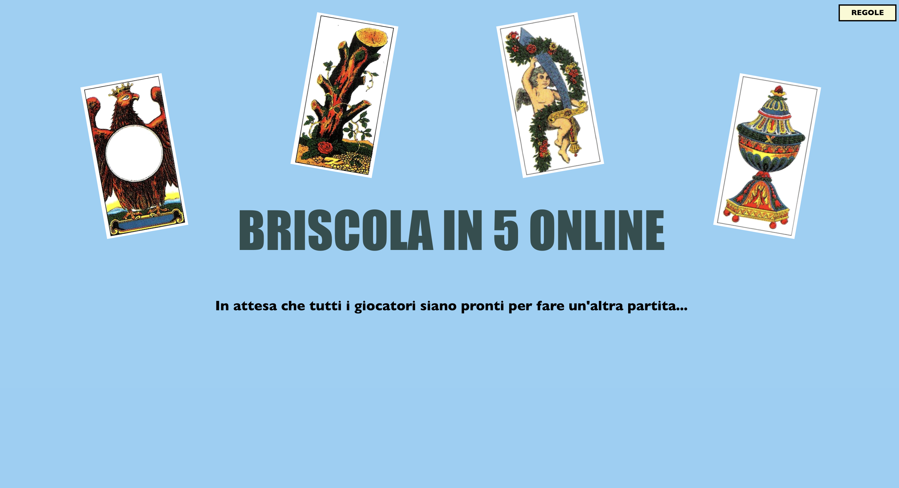

### DISCONNESSIONE DI UN GIOCATORE
Se dovesse verificarsi la disconnessione di un qualsiasi giocatore, durante tutto lo svolgimento della partita, le statistiche vengono azzerate e il server rimane in attesa della connessione di un nuovo client, mantenendo aperte le connessioni precedenti e i relativi nickname dei giocatori.


### REGOLAMENTO
Durante il corso di tutta la partita è sempre possibile visualizzare le regole del gioco, premendo l’apposito bottone in alto a destra.

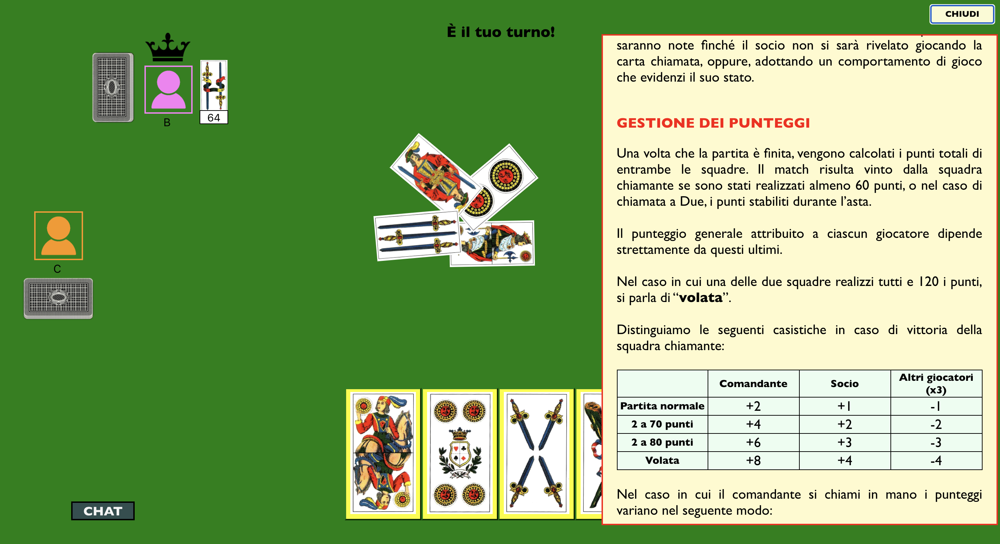

## AUTORI
- [Giorgia Tedaldi](giorgia.tedaldi@studenti.unipr.it)
- [Martina Frati](martina.frati1@studenti.unipr.it)
